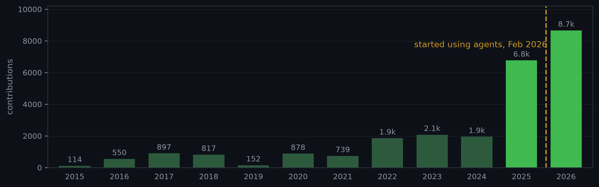

# Lethale

### Web3 CTO & full-stack engineer · Solidity · Ruby on Rails · open to part-time freelance/contract work (remote)

## About

I'm a CTO and full-stack engineer. Professional since 2015, writing code since 2010, into computers since 1993. Most of my time these days is trading and prediction-market infra: mobile apps, wallets, smart contracts, backends — the whole stack, end to end.

I work mainly in Ruby, Python, TypeScript, Solidity, and SQL, but I've jumped around enough stacks that picking up a new one isn't an issue. I also build a lot with LLMs and agents, and I mentor on Solidity and Rails.

Right now I'm CTO at Mog, Perps.fun, and League.fun. On the side I take on part-time freelance/contract work, mostly Web3.

**Stack:** Solidity · Ruby on Rails · TypeScript · Python · SQL · React Native / Expo · Vue / Nuxt · Hyperliquid · EVM

## Current work

**[Mog](https://mog.xyz)** — Perps with no market makers. Long or short stocks, memes, and more with up to 1,000x leverage, oracle-priced, no order book, no funding fees. Chief Technology Officer. → [app](https://app.mog.xyz) · [docs](https://docs.mog.xyz/)

**[Perps.fun](https://perps.fun)** — Launchpad for perp markets on Hyperliquid (HIP-3), with SEDA oracles, crowdfunded market seeding, and fee-sharing for creators. Chief Technology Officer. → [github.com/Perps-fun](https://github.com/Perps-fun)

**[League.fun](https://league.fun)** — Fantasy sports, but for crypto. Draft a team of coins, go head-to-head with other players, win USDC on Base. Chief Technology Officer.

## No longer maintained

**[Aura](https://aura.money)** — Mobile + desktop trading app that put Hyperliquid and Polymarket behind one wallet and login: perps, spot, and prediction markets, with Apple Pay / Google Pay onramps and BTC/ETH/SOL deposits. I was CTO. → [github.com/AuraDotMoney](https://github.com/AuraDotMoney)

**[BeraNames](https://www.beranames.com/)** — Name service on Berachain. Claim a `.🐻⛓️` name as an NFT, point it at your wallet, build a Berachain ID around it. I built it; it's not maintained anymore.

## Before Web3

- Founder at a startup (2015–2019) — started Rails backend, ended up full-stack plus everything else a startup throws at you. Ran the main product on Vue/Nuxt + Rails API.
- Rails + Vue in Berlin (2020–2022) — backends, video infra, Heroku plumbing.
- CS bachelor's + master's in Data Science. Thesis on patent co-citation networks.

Most of that earlier code still lives on my old GitHub accounts — I'll merge it over here when I get the time.

## Contributions

Combined public contributions per calendar year. 2026 is partial (through September).

## Engagements

I do part-time freelance and contract work next to the CTO role — mostly Web3 builds end to end (contracts up through app), trading and DeFi integrations (Hyperliquid, Polymarket, wallet infra), Rails backends, and React Native / Expo mobile. I work best on well-scoped projects, integrations, and advisory. I'm anon here, but happy to share LinkedIn, full CV, and references with serious clients under NDA. Reach out on X:

## Outside of work

Away from the keyboard, I play saxophone, climb, and practice acroyoga.

---

Remote · CET timezone · pro since 2015 · coding since 2010 · into computers since 1993

